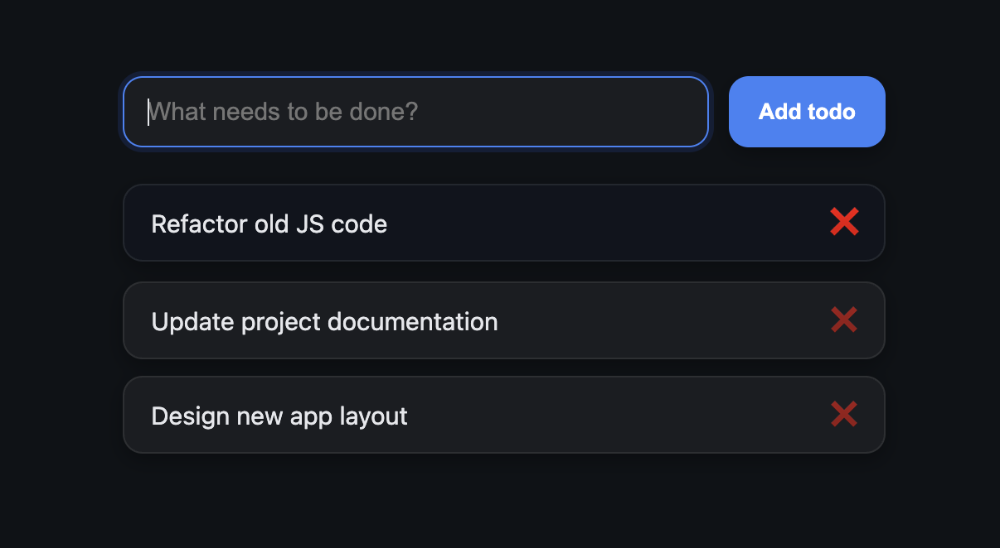

# 📝 Minimal Todo App — v1.0

A clean and minimal **To-Do List** built with HTML, CSS, and JavaScript.
Lightweight, fast, and easy to use — perfect for simple task management.

## 🧩 Version

**v1.0 — Initial release**  
This is the first stable version of the app, featuring core functionality and a polished minimalist design.

## ✨ Features

- Add tasks with a button **or the Enter key**
- Delete tasks instantly with ❌
- Tasks persist using **LocalStorage**
- Responsive and minimalist design
- Smooth animations and subtle shadows

## 🚀 Getting Started

1. Clone this repository:
   ```bash
   git clone https://github.com/sabyrzhanik/todo-app.git
   ```
2. Navigate to the project folder:
   ```bash
   cd todo-app
   ```
3. Open `index.html` directly in your browser.

## 📂 Project Structure

```
├── index.html
├── main.css
├── scripts/
│   ├── app.js
│   └── helpers/
│       ├── domHelpers.js
│       └── localStorageHelpers.js
```

## 🖼️ Preview



---

💡 _Minimalism + clean code = productivity._
